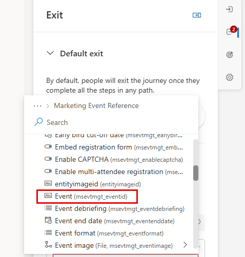
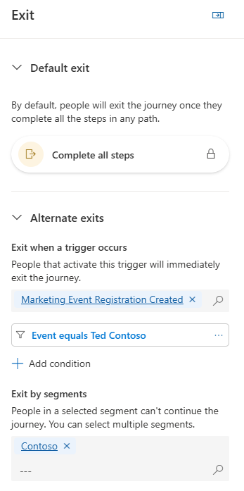

---
lab:
  title: 'Lab 3: Erstellen einer segmentbasierten Journey'
---
## Lab 3: Erstellen einer segmentbasierten Journey 

In diesem Lab lernen Sie Folgendes:
- Erstellen einer Journey basierend auf einem Segment 
- Definieren von Beendigungskriterien für das Segment 

### Aufgabe 1: Erstellen einer segmentbasierten Journey 
Contoso möchte in der Lage sein, mit Kunden in Kontakt zu treten, die bestimmte demografische Kriterien erfüllen. Dazu erstellen sie eine segmentbasierte Journey.

1. Wählen Sie unter „Kundenbindung“ die Option **Journeys** aus.

1. Klicken Sie in der Befehlsleiste auf **+ Neue Journey**.

1. Wählen Sie **Überspringen und ohne Vorlage erstellen** aus.

1. Geben Sie in „Journey benennen“ den Namen **Seattle Campaign** ein.

1. Wählen Sie unter „Journeytyp auswählen“ die Option **Segmentbasiert** aus.

1. Wählen Sie in „Segment auswählen“ die Option **Seattle Customers** aus.

1. Wählen Sie in „Häufigkeit auswählen“ die Option **Eine sich wiederholende Journey, bei der alle Benutzergruppenmitglieder die Journey wiederholen alle:**

1. Wählen Sie **6 Wochen** aus.

1. Legen Sie die Zeitzone auf Ihre Zeitzone fest.

1. Legen Sie das Startdatum auf das heutige Datum 30 Minuten ab jetzt fest.

1. Legen Sie das Enddatum auf etwa sechs Monate ab heute fest.

1. Klicken Sie auf **Erstellen**.

1. Stellen Sie in den Einstellungen der Journey auf der rechten Seite sicher, dass Sie den Abschnitt **Eintrag** ausgewählt haben.

1. Wechseln Sie zu **Nach Segmenten ausschließen**, und wählen Sie **Geschäftskunden** aus.

### Aufgabe 2: Definieren der Beendigungskriterien für die Journey
Da das Ziel dieser Journey darin besteht, die Menschen dazu zu bringen, sich für ein Marketingereignis zu registrieren, möchten wir sicherstellen, dass die Journey nach der Registrierung für sie endet, unabhängig davon, wo sie sich in der Journey befinden.  Wenn Mitarbeitende von Contoso in Seattle leben, möchten wir außerdem, dass sie über das bevorstehende Ereignis informiert sind. Wir möchten jedoch nicht, dass sie die Journey selbst durchgehen. Aus diesem Grund beschränken wir, wer die Journey fortsetzen kann.  

1.  Wählen Sie den Abschnitt **Beenden** aus.  

1.  Wählen Sie unter dem Abschnitt **Beenden, wenn ein Auslöser auftritt** die Option **Registrierung für Marketingereignis erstellt** aus.

1.  Wählen Sie **Bedingung hinzufügen** aus.

1.  Erweitern Sie **Registrierung für Marketingereignis erstellt** und dann **Referenz zum Marketingereignis**.

1.  Wählen Sie **Ereignis** aus.

    

1.  Legen Sie den Operator auf **Ist gleich** fest.

1.  Legen Sie den Wert auf **Ted Contoso** fest.

1. Legen Sie in **Nach Segmenten beenden** den Wert auf **Contoso Customers** fest. Die Beendigungskriterien sollten wie die folgende Abbildung aussehen.

    

### Aufgabe 3: Erstellen der Journey
Nachdem wir nun die verschiedenen Kriterien für diese Journey definiert haben, werden wir die Journey selbst erstellen.  

1. Klicken Sie im Journey-Designer auf das **Plus-Symbol (+)** unter der Kachel „Kontakt erstellt“.

1. Wählen Sie **Attribut-Zweig (Zweig basiert auf einem bestimmten Wert)** aus.

1. Nennen Sie in „Anzeigename“ auf der rechten Seite das Attribut **New Business Customer**.

1. Wählen Sie **Verzweigung 1** aus. Suchen Sie dann in „Attribut auswählen“ unter **Kontakt** nach **Beschreibung (Beschreibung)**.

1. Ändern Sie den Wert von „Ist gleich“ in **Enthält**.

1. Geben Sie in „Wert“ **Business** ein.

1. Klicken Sie auf das **Plus-Symbol (+)** unter „Verzweigung 1“.

1. Wählen Sie **E-Mail: E-Mail senden** aus.

1. Wählen Sie in „E-Mail auswählen“ die Option **Willkommens-E-Mail 1** aus.

1. Klicken Sie auf das **Plus-Symbol (+)** unter der Kachel „E-Mail senden“.

1. Wählen Sie **Auf Trigger warten** aus.

1. Wählen Sie im Bereich „Falls/dann-Verzweigung“ auf der rechten Seite unter „Warten auf“ einen Verzweigungsbedingungstyp und **Die vorherige Nachricht erhält eine Interaktion.** aus.

1. Wählen Sie unter „Interaktion auswählen“ die Option **E-Mail-Link angeklickt**.

1. Geben Sie bei **Was ist das Zeitlimit?**, „10 Minuten“ ein.

1. Wählen Sie im Diagramm „Journey“ die Option **Verzweigungen erstellen** aus, um den Link anzugeben, auf den geklickt wurde.

1. Wählen Sie das Attribut **E-Mail-Link angeklickt** aus.

1. Wählen Sie in „Verzweigung 1“ einen Link aus, und klicken Sie auf die Schaltfläche mit dem Handlungsaufruf in der E-Mail.

1. Klicken Sie unter der Schaltfläche auf den Pfad, und klicken Sie auf das **Plussymbol (+)**.

1. Wählen Sie **E-Mail senden** aus.

1. Wählen Sie in „E-Mail auswählen“ die Option **Willkommens-E-Mail 2** aus.

1. Klicken Sie im entsprechenden Pfad „Nein“ auf das **Plussymbol (+)**.

1. Wählen Sie **E-Mail senden** aus.

1. Wählen Sie in „E-Mail auswählen“ die Option **Willkommens-E-Mail 3** aus.

1. Speichern Sie die Journey.

1. Überprüfen Sie die Journey. Nehmen Sie ggf. letzte Änderungen vor.

1. Klicken Sie auf **Veröffentlichen**. Warten Sie, bis die Journey veröffentlicht wurde.

